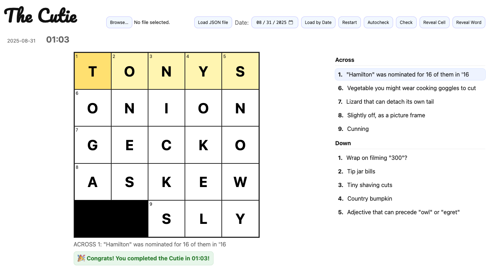

# 🧩 The Cutie: Your Daily 5×5 Crossword
By Shrihan Agarwal and Vismaya Pillai



Welcome to **The Cutie** — a bite-sized crossword puzzle you can play every day, right in your browser!  
Think of it as your daily brain-stretch… but cuter. ✨

---

## ✨ What is The Cutie?
- A **5×5 crossword** — small enough to squeeze in between sips of coffee ☕,  
  but tricky enough to make you feel clever. 😎  
- **Updated daily** with fresh puzzles.  
- Styled with love (and a little bit of CSS magic).  
- Runs entirely in your browser — no accounts, no downloads, just play.

---

## 🎮 Features
- 🗓️ Load today’s puzzle (or pick a date to revisit the archives).  
- 📂 Load your own puzzle JSON files (yes, you can make custom Cuties!).  
- 🔄 Restart anytime if you want a fresh crack at it.  
- ✅ Toggle **Autocheck** to see if you’re on the right track.  
- ✨ Reveal just a cell… or a whole word if you’re really stuck.  
- ⏱️ Built-in timer to race yourself (or your friends).  
- 🖋️ Smooth keyboard navigation, just like the big crosswords.

---

## 🌍 Updates
Crosswords are refreshed at **3, 4, and 5 AM UTC** daily.  
So wherever you are in the world, your next Cutie will be waiting for you.  

---

## 💡 How to Play
1. Open the page in your browser.  
2. Click a clue or tap a square to start typing.  
3. Use arrow keys, **Tab/Shift+Tab**, and **Enter/Space** to zip around.  
4. Fill in all the words and bask in your crossword glory. 🏆  

---

## 🛠️ Development
This is a static HTML/JS project. To run locally:
```bash
git clone https://github.com/yourname/cutie.git
cd cutie
open index.html
```

Tips for developers:
- Puzzles are JSON files (schema included in `puzzles/` — follow the format to add puzzles).  
- The UI is intentionally minimal and accessible — feel free to improve styles or keyboard behavior.  
- If you add new features, please keep the UI responsive (5×5 should look great on phones).

---

## 🤝 Contributing
PRs, puzzle submissions, and bug reports are welcome. Keep things:
- small and cute,
- accessible,
- and fun.

If you submit puzzles, please include date metadata so they slot into the daily rotation.

---

## 👩‍🎨 Credits
- Crosswords and code by **John**  
- Fonts and vibes: [Google Fonts – Pacifico](https://fonts.google.com/specimen/Pacifico)  
- Built with a love of tiny challenges and big smiles.

---

## 🖼️ Screenshot / Demo (optional)
Want a preview in the README? Add a GIF or screenshot named `demo.gif` or `screenshot.png` to the repo and include it like this:

