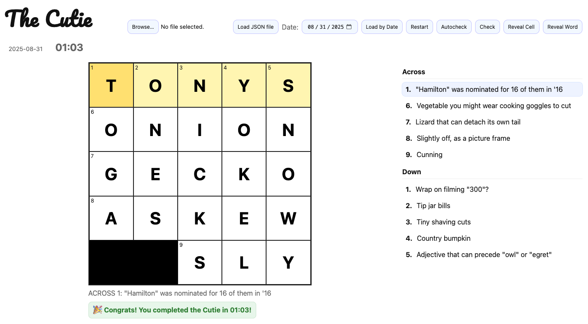

# 🧩 The Cutie: Your Daily 5×5 Crossword
By Shrihan Agarwal



Welcome to **The Cutie** — a daily bite-sized crossword puzzle.

---

## What is The Cutie?
- A **5×5 crossword** — small enough to squeeze in between sips of coffee ☕,  
  but tricky enough to make you feel clever. Or rage, depending on the clue!
- **Updated daily** with fresh puzzles.  

---

## Features
- You can load today’s puzzle (or pick a date to revisit the archives).  
- Load your own puzzle JSON files (you can make a custom cutie to share with friends!).  
- Toggle **Autocheck** to see if you’re on the right track.  
- Built-in timer to race yourself (or your friends).  
- Smooth keyboard navigation.

---

## Updates
Crosswords are refreshed by **5 AM UTC** daily.  
So wherever you are in the world, your next Cutie will be waiting for you.  

---

## How to Play
1. Open the page in your browser.  
2. Click a clue or tap a square to start typing.  
3. Use arrow keys, **Tab/Shift+Tab**, and **Enter/Space** to zip around.  
4. Fill in all the words and bask in your crossword glory.  

---

## Development
This is a static HTML/JS project. To run locally:
```bash
git clone https://github.com/yourname/cutie.git
cd cutie
open index.html
```

Tips for developers:
- Puzzles are b64 encoded JSON files so someone cannot easily cheat (schema included in `puzzles/`).
- The UI is intentionally minimal and accessible.
- `index.html` is the website code.

---

## Contributing
PRs, puzzle submissions, and bug reports are welcome. If you make changes, keep things:
- In the same ~vibe~
- Add features rather than changing existing features.
- UI changes are welcomed, other changes may not be accepted.

You can submit your own puzzles to the submitted_puzzles/ folder.

---
